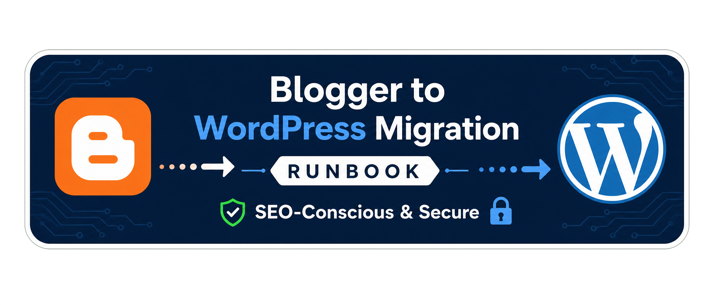

# Blogger to WordPress Migration Runbook

A practical, SEO-conscious runbook for moving a **Blogger or Blogspot website to WordPress** while protecting content, images, authors, dates, URLs, redirects, and the visitor experience.

> **Migration is more than exporting an XML file.** A successful transfer prepares the destination, maps the content, checks media and formatting, preserves important URLs, validates the new site, and monitors the launch.

[Visit DevJoynal](https://devjoynal.com/?utm_source=github&utm_medium=referral&utm_campaign=blogger-wordpress-migration) · [WordPress Malware Removal Checklist](https://github.com/joynalabddin/wordpress-security-checklist) · [Facebook](https://web.facebook.com/Devjoynal/)

## Special Offer for GitHub Visitors

Get **20% off Blogger-to-WordPress migration services** when you mention this repository.

| Offer | Details |
| --- | --- |
| Coupon code | `GITHUB20` |
| Typical scope | Blogger XML transfer, images, labels, dates, authors, URL mapping, redirects, SEO checks, and post-launch validation |
| Redeem | Mention the code when contacting [DevJoynal](https://devjoynal.com/?utm_source=github&utm_medium=referral&utm_campaign=blogger-wordpress-migration) |

> The offer must be confirmed before work begins. Final scope, price, timeline, and required access depend on the source site, content volume, media, widgets, comments, URL patterns, and manual review needs.

## What This Runbook Covers

This guide is for site owners, bloggers, developers, and support teams. It covers source auditing, Blogger XML backup, WordPress preparation, content transfer, images and embedded media, labels, authors, dates, URL planning, redirects, SEO validation, launch monitoring, and rollback documentation.

Blogger templates, custom widgets, comments, media hosts, URL patterns, and unusual HTML may require manual review. This runbook favors transparent scope and quality checks rather than promising a perfect one-click migration for every website.

## Quick Migration Map

| Stage | Main outcome |
| --- | --- |
| Audit | Source inventory, risk list, and agreed migration scope |
| Backup | Preserved Blogger export and supporting source assets |
| Prepare | Secure WordPress destination with intentional permalinks |
| Transfer | Posts, pages, media, labels, authors, dates, and supported comments reviewed |
| Redirect | Important old URLs mapped to genuine new destinations |
| Validate | Content, design, SEO, forms, media, and redirects tested |
| Monitor | Search visibility, errors, traffic, and user reports reviewed |

## 1. Audit the Blogger Website

- [ ] Record the custom domain, Blogspot address, HTTPS status, language, and approximate post/page count.
- [ ] Export a URL inventory covering posts, pages, label archives, feeds, images, downloads, and important landing pages.
- [ ] Review the Blogger template, custom widgets, navigation, forms, comments, videos, scripts, and integrations.
- [ ] Identify high-traffic, high-conversion, frequently linked, and recently updated content.
- [ ] Confirm ownership of the domain, hosting, DNS, analytics, Search Console, and social accounts.
- [ ] Define what will be transferred, rebuilt, excluded, or reviewed manually.

## 2. Backup and Prepare WordPress

- [ ] Download the Blogger export XML from **Settings → Manage blog → Back up content**.
- [ ] Keep the original XML unchanged and store a second dated copy safely.
- [ ] Save important images, downloads, theme assets, custom HTML, and integration settings.
- [ ] Use supported WordPress, HTTPS, reliable hosting, and a protected staging environment.
- [ ] Choose a permalink structure after comparing it with old Blogger URLs.
- [ ] Configure users, categories, tags, menus, forms, backups, security, and rollback access.

## 3. Content Transfer Workflow

1. Export the Blogger XML and keep the source copy unchanged.
2. Import into a clean WordPress staging environment using a suitable importer or agreed manual process.
3. Compare expected posts, pages, comments, authors, and media references with the result.
4. Preserve publication dates and authors where possible, documenting exceptions.
5. Map Blogger **labels** to an intentional WordPress category and tag structure.
6. Review titles, headings, HTML, captions, excerpts, videos, internal links, drafts, and duplicates.
7. Check featured images, inline images, Blogger CDN URLs, alt text, captions, dimensions, and compression.
8. Rebuild unsupported widgets, galleries, forms, downloads, scripts, and embeds with WordPress alternatives.

## 4. URL Structure and Redirect Planning

- [ ] Compare the old Blogger URL pattern with the proposed WordPress permalink structure.
- [ ] Create a redirect map for the homepage, posts, pages, important labels, feeds, and high-value indexed URLs.
- [ ] Send each old URL to a genuine equivalent; do not send every URL to the homepage.
- [ ] Check trailing slashes, date segments, URL encoding, HTTPS, host variations, and canonicals.
- [ ] Test redirects from the old Blogspot address and old custom domain where applicable.
- [ ] Avoid redirect chains, loops, mixed content, and accidental noindex settings.
- [ ] Update internal links, XML sitemap, Search Console, analytics, canonicals, and social links.

## 5. Pre-Launch Validation

### Content and design

- [ ] Posts, pages, labels/categories, tags, authors, dates, excerpts, and featured images are present.
- [ ] Images, videos, downloads, forms, menus, widgets, comments, and embeds work.
- [ ] High-value pages are manually checked for formatting and missing content.
- [ ] Mobile, tablet, desktop, accessibility basics, and navigation are tested.

### Technical and SEO checks

- [ ] HTTPS works consistently and mixed-content warnings are resolved.
- [ ] Important old URLs resolve through planned redirects without chains or loops.
- [ ] Canonical URLs, robots rules, XML sitemap, pagination, and noindex settings are intentional.
- [ ] Internal links, 404 pages, search, feeds, structured data, and navigation are tested.
- [ ] Search Console, analytics, forms, caching, backups, and security monitoring are connected.

## 6. Launch, Monitoring, and Rollback

- [ ] Create a fresh WordPress backup before launch and keep the original Blogger site available during testing.
- [ ] Schedule DNS or domain changes with a rollback contact and maintenance window.
- [ ] Review crawl errors, indexing coverage, traffic, logs, uptime, and user reports after launch.
- [ ] Document missing media, broken links, formatting issues, redirect gaps, and fixes.
- [ ] Keep the XML, WordPress backup, URL map, redirect rules, known issues, and launch checklist together.

## Common Blogger Migration Issues

| Issue | Practical response |
| --- | --- |
| Images remain on Blogger CDN | Audit image URLs, re-host where appropriate, and verify important images. |
| Custom widgets do not transfer | Recreate forms, navigation, galleries, and scripts with WordPress alternatives. |
| Comments are incomplete | Confirm importer support and plan a separate export, replacement, or manual review. |
| Labels create poor taxonomy | Map labels to a smaller, useful category/tag structure. |
| Old URLs return 404 errors | Use a tested redirect map; avoid a blanket homepage redirect. |
| Blogger markup damages formatting | Clean HTML in batches and manually inspect high-value posts. |
| Search visibility changes | Verify canonicals, sitemap, redirects, robots rules, indexing, and Search Console. |

## Illustrative Migration Case Pattern

The following is a **generic workflow example**, not a claim about a named client or a guaranteed result.

A blogger wants to move an established Blogspot site to WordPress without losing content or important search paths. The audit records the source URL, XML backup, post/page count, labels, authors, dates, image locations, custom widgets, comments, high-value pages, and current URL patterns.

The transfer is tested on staging. Content counts are compared, labels are mapped to a useful taxonomy, images and embedded media are inspected, formatting is cleaned, old URLs are mapped to genuine new destinations, and redirects are tested before launch. Post-launch review covers mobile pages, forms, 404s, Search Console, sitemap, internal links, media, and user reports. Exact work depends on the source site and approved scope.

## Frequently Asked Questions

### Is Blogger XML import enough for a complete migration?

Usually not. XML transfer is a starting point. Images, labels, authors, dates, custom widgets, comments, HTML, internal links, URLs, redirects, SEO settings, and post-launch behavior still need review.

### Will all Blogger images automatically move to WordPress?

Not always. Images may remain on a Blogger CDN, contain unusual URLs, or require manual inspection. Important images should be checked for loading, dimensions, alt text, captions, and ownership.

### Can you preserve old Blogger URLs?

The plan depends on the old URL pattern and the target WordPress permalink structure. A redirect map should send important old URLs to the most relevant new pages without chains or a blanket homepage redirect.

### Will migration guarantee that Google rankings will stay the same?

No. A careful migration can reduce avoidable technical problems, but rankings and search visibility depend on content, redirects, indexing, links, competition, user needs, technical conditions, and time.

### What should I send for an initial scope review?

Send the current Blogger or Blogspot URL, target domain, approximate post/page/media count, preferred launch date, and concerns about images, comments, labels, authors, dates, old URLs, or SEO. Do not send passwords in public messages.

### Do you also help with hacked WordPress sites?

Yes. See the [WordPress Malware Removal Checklist](https://github.com/joynalabddin/wordpress-security-checklist) for safe triage, investigation, cleanup, validation, hardening, and a separate GitHub visitor offer.

## Need Migration Help?

I’m **Joynal Abdin**, a Blogger/Blogspot-to-WordPress Migration Expert working through [DevJoynal](https://devjoynal.com/?utm_source=github&utm_medium=referral&utm_campaign=blogger-wordpress-migration). I help with content transfer, media checks, labels, dates, authors, URL mapping, redirects, SEO-conscious structure, and post-migration support.

> Planning a migration? Visit [devjoynal.com](https://devjoynal.com/?utm_source=github&utm_medium=referral&utm_campaign=blogger-wordpress-migration), mention coupon `GITHUB20`, and share the current URL, approximate content size, concerns, and preferred timeline.

## Related Resources

- [WordPress Malware Removal Checklist](https://github.com/joynalabddin/wordpress-security-checklist)
- [WordPress Website Development Guide](https://github.com/joynalabddin/wordpress-website-development-guide)
- [WordPress Speed Optimization Checklist](https://github.com/joynalabddin/wordpress-speed-optimization-checklist)
- [WordPress SEO Checklist](https://github.com/joynalabddin/wordpress-seo-checklist)
- [DevJoynal on Facebook](https://web.facebook.com/Devjoynal/)

## Maintainer

**Joynal Abdin · DevJoynal**  
Blogger/Blogspot Migration · WordPress Development · SEO-conscious Website Transfers  
[https://devjoynal.com](https://devjoynal.com)

**Move the content carefully. Preserve the URLs. Launch with confidence.**
